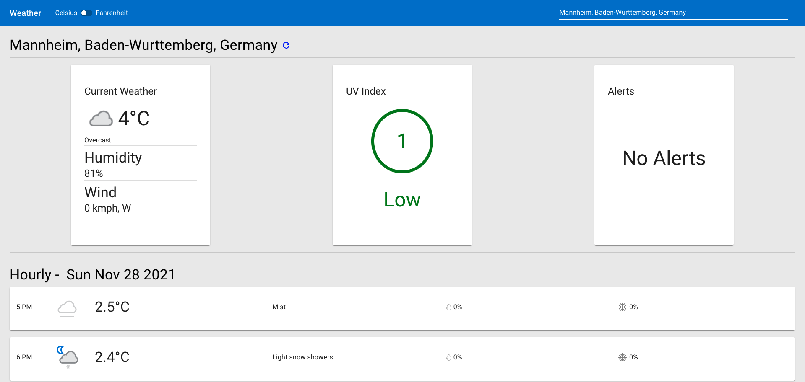
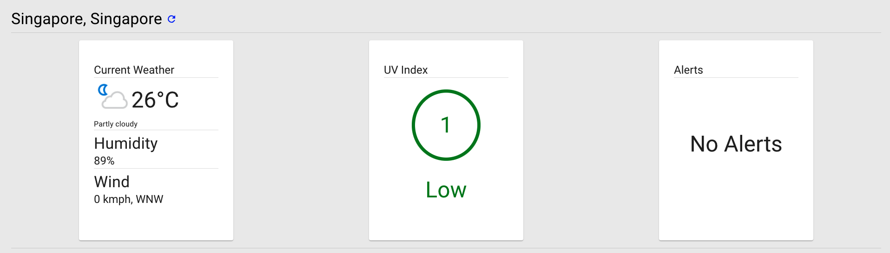
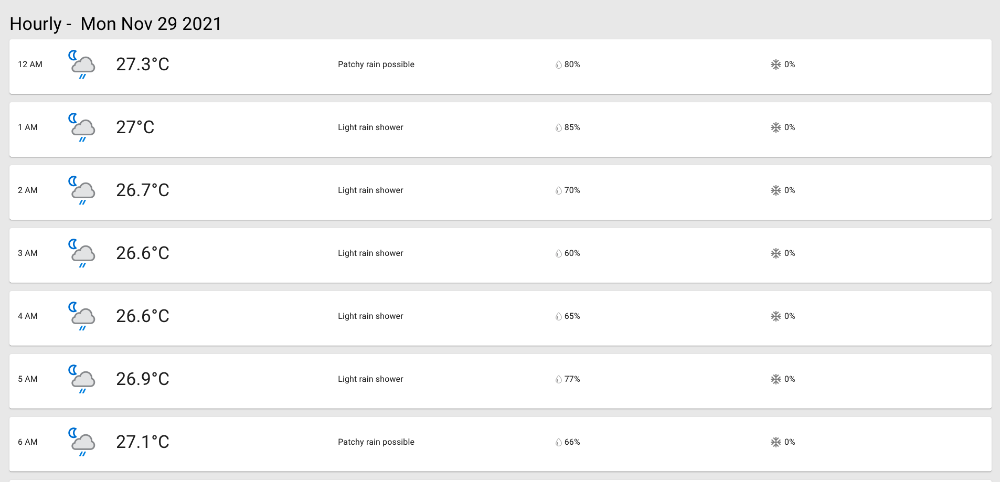
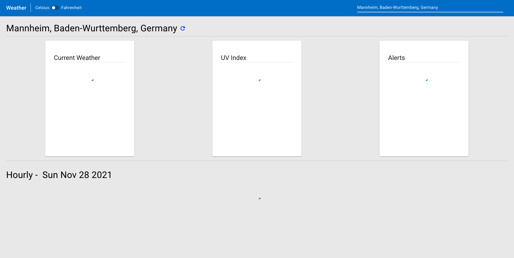
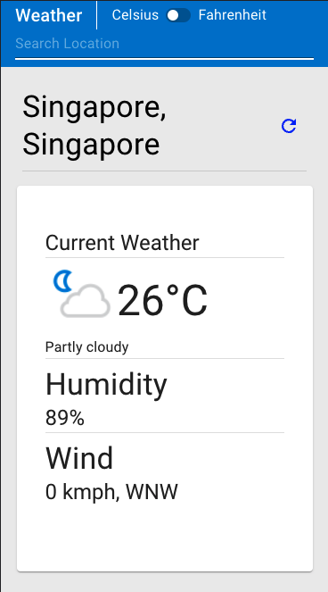
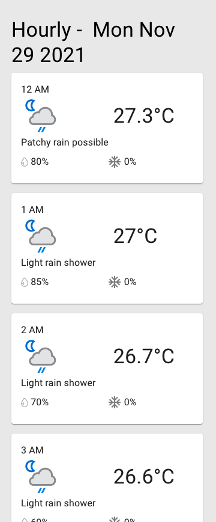

## Installation

Run `npm i` or `npm i -f`

## Running the App

Run `npm run start`

## Running the Tests

Run `npm run test`

## Functionalities

1. Display current weather conditions of city
2. Display hourly weather conditions
3. Search for city to show weather conditions
4. Show data units based on metric selected
5. Show UV and Alerts for city selected
6. Error Handling (all BE error will be catched & shown under modal)
7. Loader (display loading for all API calls)

## Test Coverage

All functioanlities and components are test covered

## Commit Structure

Semantic Commits:
https://nitayneeman.com/posts/understanding-semantic-commit-messages-using-git-and-angular/

## App ScreenShots

PC:

Mobile:

